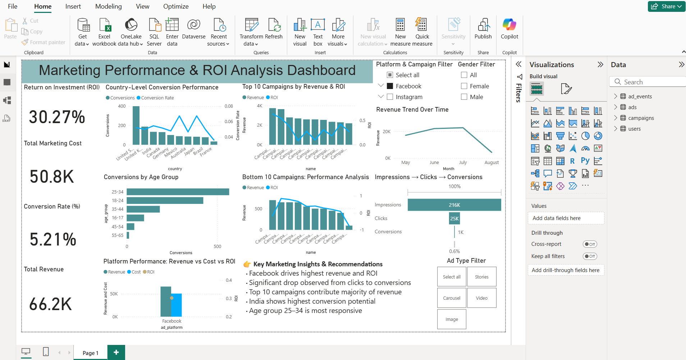

# 📊 Marketing Performance & ROI Analysis Dashboard

## 🚀 Overview
An end-to-end marketing analytics dashboard built using Power BI to evaluate campaign performance, optimize ROI, and analyze user behavior across multiple channels.

---

## 🎯 Objectives
- Analyze campaign performance across platforms and channels  
- Identify high ROI campaigns and marketing channels  
- Understand user conversion funnel behavior  
- Enable data-driven marketing decision making  

---

## 🧠 Key Insights & Recommendations
- Facebook is the most efficient marketing channel, delivering both high revenue and strong ROI  
- A significant drop from clicks to purchases indicates inefficiencies in the conversion funnel  
- Top-performing campaigns contribute the majority of overall revenue  
- United States shows strong conversion performance and high growth potential  
- Users aged 25–34 represent the most responsive audience segment  

---

## 📈 Dashboard Features
- KPI tracking: Revenue, Cost, ROI, CTR, Conversion Rate  
- Funnel analysis: Impressions → Clicks → Conversions  
- Platform performance comparison  
- Campaign analysis (Top 10 & Bottom 10 campaigns)  
- User segmentation: Country, Age Group, Gender  
- Interactive slicers and tooltips  

---

## 🛠️ Tech Stack
- Power BI  
- DAX (Data Analysis Expressions)  
- Power Query  
- Data Modeling (Star Schema)  

---

## 📂 Project Structure
data/
- ad_events.csv  
- ads.csv  
- campaigns.csv  
- users.csv  

dashboard/
- Marketing_Dashboard.pbix  

images/
- Screenshot_Dashboard.png  

---

## 📷 Dashboard Preview

---

## 💡 Business Value
- Enabled comparison of marketing performance across platforms and campaigns  
- Identified high-ROI channels for better budget allocation  
- Highlighted funnel drop-offs to improve conversion efficiency  
- Delivered actionable insights to support strategic marketing decisions  

---

## 📌 Notes
- Revenue is simulated using an assumed Average Order Value (AOV)  
- Dataset used for learning and portfolio purposes  
